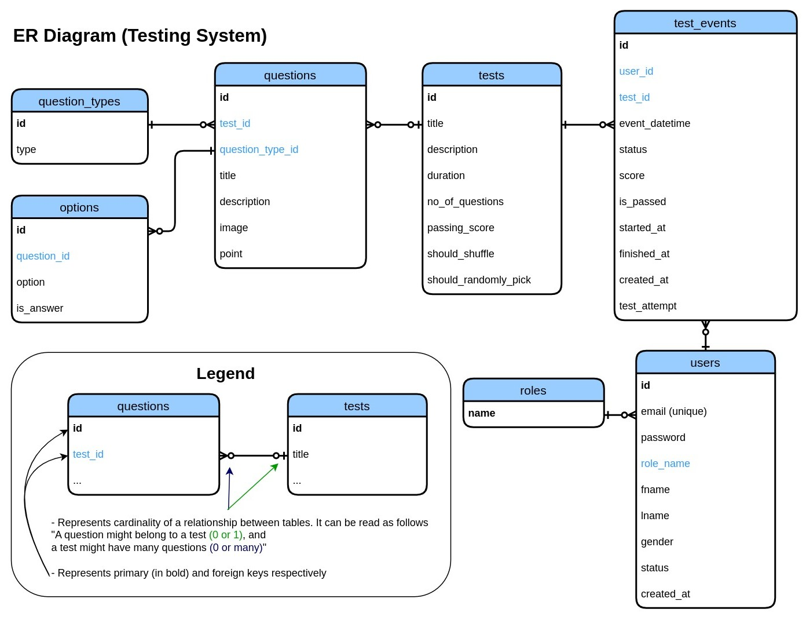

# Testing System

**_Note:_** 🚧 _This project is a work in progress. Some interruptions may occur in the production environment._ 🚧

## Overview

The Testing System REST API is a backend application designed to manage testing activities, such as test creation,
participation, and result evaluation. This project demonstrates proficiency in backend development using modern
technologies and Spring Boot framework.

## Key Features

- **User Management**: Admins manage accounts and assign tests; Test Takers participate in tests with autosave.
- **Test Management**: Admins create and assign tests with multiple question types (MCQ, Checkbox, True/False, Text).
- **Results Management**: Automatic evaluation with pass/fail status and summaries.
- **Secure and Scalable**: Role-based access control with little effort to scale, encrypted password storage, and
  modular design.

## Tech Stack

- **Backend Framework**: Spring Boot 3
- **Database**: PostgreSQL
- **Persistence**: Spring Data JDBC and Spring JDBC Template
- **Caching**: Redis (for token blocklisting & autosave test progress)
- **Security**: Spring Security (Authentication & Authorization)
- **Containerization**: Docker
- **Documentation**: Swagger UI (OpenAPI)
- **Testing & Debugging**: Postman
- **Cloud Deployment**

## Diagrams

### Entity-Relationship Diagram (ERD)

The following ER diagram outlines the core database structure of the Testing System:


### API Examples

-- TODO: add image

For exploring and testing complete API endpoints, visit
the [Swagger UI](https://testing.mirodil.dev/api/swagger-ui.html)
or [Postman collection](Testing%20System.postman_collection.json) with saved
examples.

## Installation & Setup

If you want to only access API, you can use already deployed application. But, if you still want to setup locally here
is the steps you can follow:

### Prerequisites

Before starting, ensure you have the following installed on your system:

1. [Docker](https://docs.docker.com/get-started/get-docker/): Version 20.10 or higher

2. Docker Compose: Version 1.29 or higher (if you installed Docker Desktop, then it comes out of the box)

### Steps

Clone the Testing System project from the GitHub repository:

```bash
git clone https://github.com/mirodilkamilov/testing-system.git
cd testing-system
```

Copy `.env.example` to create your `.env` file and make sure you set `SECRET_KEY` variable. It should be at least 32
character long:

```bash
cp .env.example .env
```

Run the following command to build and start the docker containers (you can add `-d` option to run in detached mode):

```docker
docker-compose up --build
```

Once the containers are running, the application will be available at http://localhost:8080. You can navigate
to http://localhost:8080/api/swagger-ui.html to view the API documentation.

To stop and remove the containers, run:

```docker
docker-compose down
```

## Contribute

I developed this project to showcase my Java skills and web technologies. Developers interested in building a
user-friendly interface for this application are welcome to contribute. I also invite anyone who wants to enhance and
extend the existing functionality, helping this project evolve and improve.

