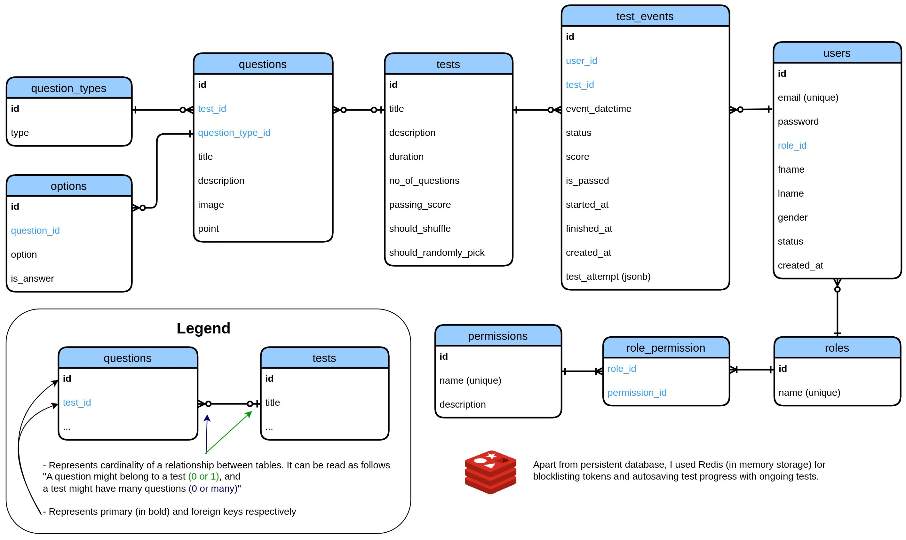

# Testing System

## Overview

The Testing System is a lightweight, RESTful MVC application for managing and conducting online tests. **Technologies Used**: Java (JDK 21), Jakarta Servlet, Maven, Tomcat, PostgreSQL, Redis, Docker, JWT (JSON Web Token), Swagger, Cloud hosting, Git/GitHub. 

## Key Features
- **User Management**: Admins manage accounts and assign tests; Test Takers participate in tests with autosave.
- **Test Management**: Admins create and assign tests with multiple question types (MCQ, Checkbox, True/False, Text).
- **Results Management**: Automatic evaluation with pass/fail status and summaries.
- **Secure and Scalable**: Role-based access control, encrypted password storage, and modular design.

## Diagrams

### Entity-Relationship Diagram (ERD)

The following ER diagram outlines the core database structure of the Testing System:

### Class Diagram

The class diagram illustrates the relationships among the core Java classes used in the application:
(Include Class Diagram Image Here)

## API Endpoints

Visit the [Swagger UI](github.com) to explore and test the API endpoints interactively.

## Installation & Setup

## Contribute

I developed this project to showcase my Java skills and web technologies. Developers interested in building a user-friendly interface for this application are welcome to contribute. I also invite anyone who wants to enhance and extend the existing functionality, helping this project evolve and improve.

